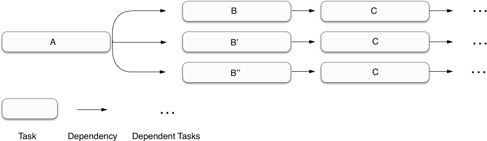
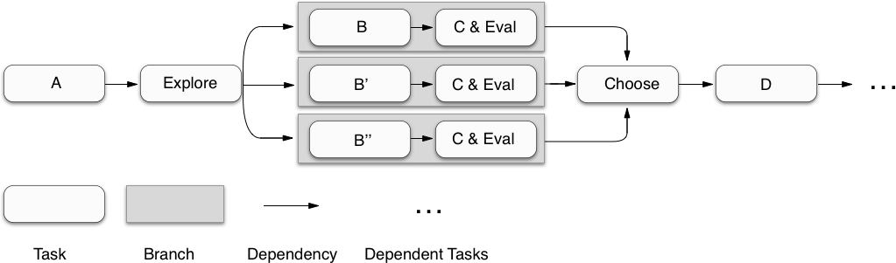
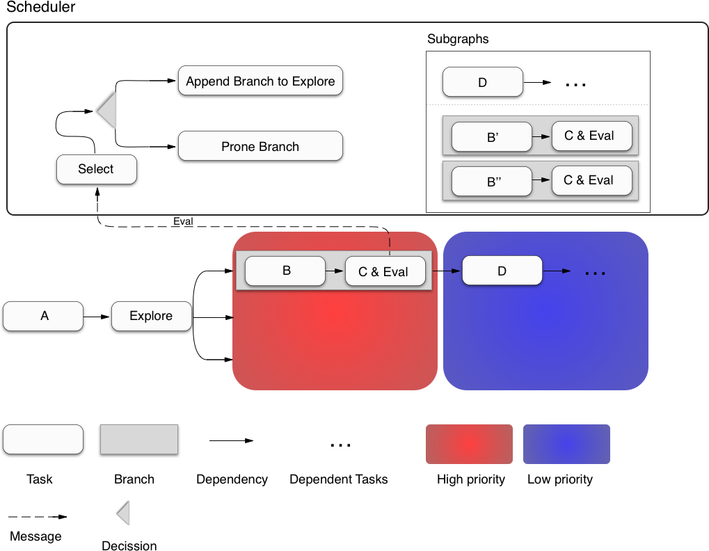

# Proposal: [generic support exploratory workflows]

Author(s): [Matthias Weidlich, Maximilian Bielefeld]

Last updated: [26.June.2018]

## Abstract

We propose to add generic support of exploratory workflows.

## Background

This [paper](https://lsds.doc.ic.ac.uk/sites/default/files/mod251-castro-fernandezA-hm.pdf) presents the idea of exploratory workflows and how to deal with them.

**Exploratory workflows** occur if a user is uncertain about a cleaning strategy or choice of a  model parameter. Then, for a particular operator in a workflow, there may be multiple configurations or variants to consider. Dask currently 
supports the definition of DAGs. Yet, when representing exploratory workflows, this model potentially leads to inefficient execution. 



**Fig.1** Example of the _current realization_

The above example DAG captures the following use case: A user defines some task with an operator A. The result of this task shall then be processed by two more operators, B and C. However, operator B exists in several variants, for instance, due to different configurations of parameter values. The variants of this operator are labeled as B,B',B'' and their results are subsequently used as input for a task related to operator C. As we can see, the size of the DAG grows with the task variants to consider.

Executing the above DAG may be inefficient as some tasks may become superfluous dynamically, while the DAG is executed. For instance, a user may only be interested in processing data with operator C that satisfies a certain quality threshold. If the data obtained when executing the task with operator B' is of low quality (e.g., operators B,B',B'' represent different configurations of an outlier filter and if they filter more than 50% of the data, the result is considered not meaningful), the subsequent task (operator C) shall not be executed anymore. Moreover, there may be dependencies among the tasks of different operator variants, so that the successful execution of one of them (successful meaning that the quality of the result data is high), renders the execution of others obsolete. For instance, if operators B,B',B'' train a model using different parameters, one may decide that after obtaining two models that show reasonable accuracy, training of a third model is no longer needed. On the DAG level, this may mean that after the execution of the tasks with operator variants B and B'', the task related to B' shall not be executed anymore. 

Against this background, the aforementioned paper proposed **Meta-Dataflows** (MDFs) to define exploratory workflows in order to achieve more efficient execution. 
A main idea of this model is to calculate the quality of the result obtained for each of the operator configurations 
(or of a branch, i.e., a sequence of tasks). Based thereon, one may prune tasks or branches that turn out to be no longer needed, either because they represent alternative or subsequent branches that turned out to be obsolete. 

For the example, adopting the ideas of the MDF model, we would have the following structure of the DAG:




**Fig.2** Example of a _meta-dataflow_


An **explore** task is the root of a set of branches. It indicates that several variants of an operator shall be considered. 

The **evaluation** tasks denote the end of a branch and represent the computation of a quality score for the result obtained in the respective branch. The above example illustrates the case that the result quality cannot be assessed directly after executing the operator variants B,B',B'', but only after operator C has also been applied.

A **choose** task selects the branches of which the results are deemed to have high quality (based on the quality scores as computed by the evaluation tasks) and, thus, shall be considered further (i.e., operator D is applied to these results). 

Examples for such selection functions are: selection of all results for which the quality is above a threshold, selection of the top-k among the results, or the selection of the first-k that are above a threshold.

When executing MDFs on a distributed dataflow system (Spark, Flink - at any point in time, each node executes the same operator in a data-parallel manner, on a different part of the respective dataset), scheduling happens ``depth-first until the next choose operator''. 
The intuition is that each branch finishes execution as quickly as possible, which then enables incremental evaluation of the results of branches and potentially prunes alternative branches.

## Proposal

We propose to add generic support for exploratory workflows using the following apporach.

1. Adding an explicit explore task. For such explore tasks, the memory handling should follow a distinguished approach. 
In order to enable dynamic adding and pruning of branches, data passed through an explore task 
(the actual task does not really do any processing) should be persisted until it is deleted explicitly. 
The explore task should be realized similar to the delayed decorater, with the difference being that it expects an identifier that can later be used to add or prune branches.

2. Adding an evaluation task. 
While the computation of the quality score happens very much like in ordinary tasks, 
the task should be able to send the computed quality score directly to the scheduler. This shall enable the scheduler to apply the selection function for the respective branches, thereby implementing pruning of branches. 

3. Adding a choose operator that is not executed as a task on a worker, but directly by the scheduler. It defines the selection strategy and potentially leads to pruning of branches. The latter would be realized by marking some tasks as not needed, i.e., conceptually, they are removed from the task queue. Evaluation of a choose operator may also control whether/when the data persisted by an explore task can be deleted.

4. Functionality to dynamically adapt the definition of a DAG. This shall include the ability to append tasks to the DAG, thereby enabling the user to add branches incrementally. It may also include functionality to remove tasks and subgraphs in order to realize pruning of branches. However, the latter may also be achieved differently, by blacklisting those tasks in the task queue that represent parts of pruned branches.

## Rationale

The system shall execute the DAG as fast as possible. Therefore, the following aspects shall be considered in the design of the scheduling:
 * Tasks of a single branches shall execute with high priority. This way, a choose operator is reached quickly, which potentially enables pruning of superfluous (alternative or subsequent) branches. 
 * Yet, depth-first scheduling may not saturate all workers. Then, processing shall (in parallel to evaluating alternative branches) also consider tasks that are dependent on the tasks of the completed branch (speculative execution of tasks that are deeper in the DAG structure). This may lead to unnecessary computation (as these tasks may later turn out to be part of pruned branches), yet it may reduce the time-to-completion if not all workers are busy with tasks of branches that are alternative to the completed one.

## Implementation

**A propsal of how a user shall be able to define an MDF, for the given example:**


```python
	@dask.explore(id="identifier")
	def a(x):
		return foo(x)
		
	@dask.delayed
	def b(x, y):
		return baa(x + y)
	
	def cond(x):
		return x > 10
	
	@dask.evaluate(condition=cond)
	def c(x):
		return foobar(x)
	
	@dask.choose(id="identifier")
	def d(x):
		return foofoo(x)
	
	a = a(data)
	b0 = b(a, 2)
	b1 = b(a, 4)
	b2 = b(a, 6)
	c0 = c(b0)
	c1 = c(b1)
	c2 = c(b2)
	d = d(a)
```
&nbsp;
&nbsp;

**How the execution of this DAG should work:**



The above figure indicates how the execution of the example DAG should be performed. After the execution of a branch
(in the figure: B, C & Eval), the scheduler receives an evaluate message from the node that executed the last task. Based on this message, the scheduler decides, which tasks to add to the executed DAG. That may include adding tasks of further branches or tasks that work on the results of the task that just finished execution. The possible continuations (sub-graphs) of the executed DAG are known from the definition of the MDF, i.e., the explore and choose tasks.
